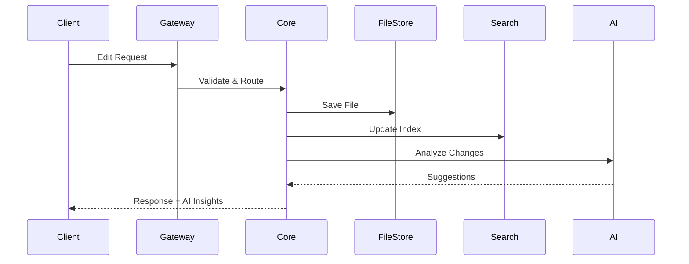
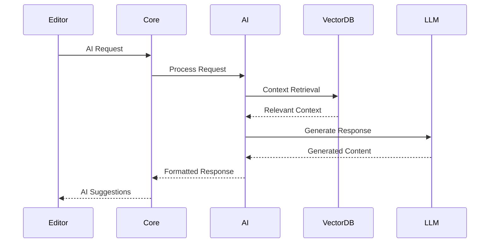
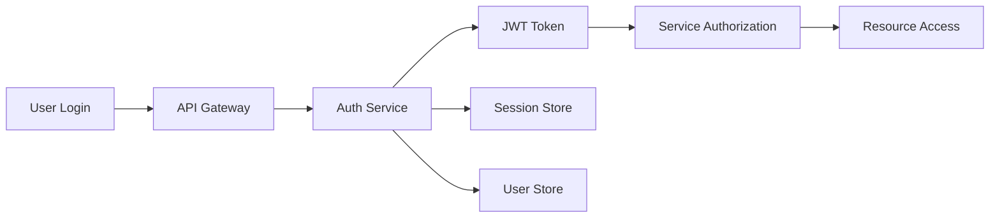

# アーキテクチャ - Test Editor

Test Editorのシステムアーキテクチャと技術的な実装について詳しく説明します。マイクロサービス設計、データフロー、および各コンポーネントの役割を理解できます。

## システム概要

Test Editorは、モジュラー設計とマイクロサービスアーキテクチャを採用した、スケーラブルなAI搭載テキストエディタです。

### 主要設計原則

- **分離性**: 各機能を独立したモジュールとして実装
- **拡張性**: プラグインシステムによる機能拡張
- **パフォーマンス**: 非同期処理とキャッシングの最適化
- **セキュリティ**: 多層防御とゼロトラスト原則

## 全体アーキテクチャ

```
┌─────────────────┐    ┌──────────────────┐    ┌─────────────────┐
│   Web Client    │    │  Desktop Client  │    │  Mobile Client  │
│   (React/TS)    │    │   (Electron)     │    │    (React)      │
└─────────┬───────┘    └────────┬─────────┘    └─────────┬───────┘
          │                     │                        │
          └─────────────────────┼────────────────────────┘
                                │
┌─────────────────────────────────────────────────────────────────┐
│                          API Gateway                           │
│                       (Kong/Envoy)                             │
└─────────────────────────┬───────────────────────────────────────┘
                          │
    ┌─────────────────────┼─────────────────────┐
    │                     │                     │
┌───▼────┐    ┌──────▼───────┐    ┌──────▼──────┐
│ Auth   │    │   Core       │    │   AI        │
│Service │    │   Service    │    │   Service   │
└────────┘    └──────────────┘    └─────────────┘
    │              │                     │
┌───▼────┐    ┌────▼────┐    ┌─────▼─────┐    ┌──────▼──────┐
│ User   │    │  File   │    │  Search   │    │  Collab     │
│ Store  │    │ Store   │    │  Engine   │    │  Service    │
└────────┘    └─────────┘    └───────────┘    └─────────────┘
```

## コア サービス

### 1. API Gateway

**技術スタック**: Kong / Envoy Proxy
**責任範囲**:
- リクエストルーティング
- 認証・認可
- レート制限
- ロードバランシング
- SSL/TLS 終端

```yaml
# Kong設定例
services:
  - name: core-service
    url: http://core-service:3000
    routes:
      - name: api-route
        paths: ["/api/v1"]
        methods: ["GET", "POST", "PUT", "DELETE"]
    plugins:
      - name: rate-limiting
        config:
          minute: 100
          hour: 1000
```

### 2. Core Service (コアサービス)

**技術スタック**: Node.js / Express / TypeScript
**データベース**: PostgreSQL (メタデータ) + Redis (キャッシュ)

```typescript
// コアサービスの主要コンポーネント
interface CoreServiceInterface {
  projectManager: ProjectManager;
  fileManager: FileManager;
  versionControl: VersionControlSystem;
  eventBus: EventBus;
  pluginManager: PluginManager;
}

class CoreService implements CoreServiceInterface {
  async initialize(): Promise<void> {
    await this.setupDatabase();
    await this.loadPlugins();
    await this.startEventListeners();
  }
}
```

**主要機能**:
- プロジェクト管理
- ファイルシステム操作
- バージョン管理
- イベント処理
- プラグイン管理

### 3. AI Service (AIサービス)

**技術スタック**: Python / FastAPI / PyTorch
**インフラ**: CUDA対応 GPU / TensorRT

```python
# AI サービスの構成
class AIService:
    def __init__(self):
        self.llm_provider = LLMProvider()
        self.embedding_model = SentenceTransformer()
        self.code_analyzer = CodeAnalyzer()

    async def generate_code(self, prompt: str, context: str) -> str:
        return await self.llm_provider.generate(
            prompt=prompt,
            context=context,
            max_tokens=2048
        )

    async def semantic_search(self, query: str) -> List[SearchResult]:
        embedding = self.embedding_model.encode(query)
        return await self.vector_store.similarity_search(embedding)
```

**機能詳細**:
- コード生成・補完
- セマンティック検索
- バグ検出・修正提案
- コードレビュー
- 自然言語からのコード変換

### 4. Search Engine (検索エンジン)

**技術スタック**: Elasticsearch / Vector DB (Pinecone/Weaviate)

```json
{
  "settings": {
    "index": {
      "number_of_shards": 3,
      "number_of_replicas": 1
    },
    "analysis": {
      "analyzer": {
        "code_analyzer": {
          "tokenizer": "keyword",
          "filters": ["lowercase", "stop"]
        }
      }
    }
  },
  "mappings": {
    "properties": {
      "content": {
        "type": "text",
        "analyzer": "code_analyzer"
      },
      "embedding": {
        "type": "dense_vector",
        "dims": 768
      },
      "file_path": {
        "type": "keyword"
      },
      "language": {
        "type": "keyword"
      }
    }
  }
}
```

## データフロー

### 1. ファイル編集フロー



### 2. AI機能フロー



## データ設計

### 1. プロジェクト データモデル

```sql
-- プロジェクト管理
CREATE TABLE projects (
    id UUID PRIMARY KEY DEFAULT gen_random_uuid(),
    name VARCHAR(255) NOT NULL,
    description TEXT,
    owner_id UUID REFERENCES users(id),
    settings JSONB DEFAULT '{}',
    created_at TIMESTAMP DEFAULT NOW(),
    updated_at TIMESTAMP DEFAULT NOW()
);

-- ファイル管理
CREATE TABLE files (
    id UUID PRIMARY KEY DEFAULT gen_random_uuid(),
    project_id UUID REFERENCES projects(id),
    path VARCHAR(1000) NOT NULL,
    content TEXT,
    language VARCHAR(50),
    size_bytes INTEGER,
    hash_md5 VARCHAR(32),
    created_at TIMESTAMP DEFAULT NOW(),
    modified_at TIMESTAMP DEFAULT NOW()
);

-- セマンティック検索用
CREATE TABLE file_chunks (
    id UUID PRIMARY KEY DEFAULT gen_random_uuid(),
    file_id UUID REFERENCES files(id),
    chunk_index INTEGER,
    content TEXT NOT NULL,
    embedding vector(768),
    metadata JSONB DEFAULT '{}'
);

-- インデックス最適化
CREATE INDEX idx_files_project_path ON files(project_id, path);
CREATE INDEX idx_file_chunks_embedding ON file_chunks USING ivfflat (embedding vector_cosine_ops);
```

### 2. ユーザー・認証

```sql
-- ユーザー管理
CREATE TABLE users (
    id UUID PRIMARY KEY DEFAULT gen_random_uuid(),
    username VARCHAR(50) UNIQUE NOT NULL,
    email VARCHAR(255) UNIQUE NOT NULL,
    password_hash VARCHAR(255) NOT NULL,
    profile JSONB DEFAULT '{}',
    is_active BOOLEAN DEFAULT true,
    created_at TIMESTAMP DEFAULT NOW()
);

-- セッション管理
CREATE TABLE user_sessions (
    id UUID PRIMARY KEY DEFAULT gen_random_uuid(),
    user_id UUID REFERENCES users(id),
    token_hash VARCHAR(255) NOT NULL,
    expires_at TIMESTAMP NOT NULL,
    created_at TIMESTAMP DEFAULT NOW()
);
```

## セキュリティアーキテクチャ

### 1. 認証・認可フロー



### 2. セキュリティ層

```yaml
# セキュリティ設定
security:
  authentication:
    providers:
      - jwt
      - oauth2
      - api_key
  encryption:
    at_rest: AES-256
    in_transit: TLS-1.3
  access_control:
    rbac: enabled
    policy_engine: OPA
```

## パフォーマンス最適化

### 1. キャッシング戦略

```typescript
interface CacheStrategy {
  // L1: In-Memory Cache (Node.js)
  memory: {
    ttl: 300; // 5分
    maxSize: '100MB';
  };

  // L2: Redis Cache
  redis: {
    ttl: 3600; // 1時間
    cluster: true;
  };

  // L3: CDN Cache
  cdn: {
    ttl: 86400; // 24時間
    invalidation: 'automatic';
  };
}
```

### 2. 非同期処理

```typescript
// ワーカープール設計
class WorkerPool {
  private workers: Worker[] = [];
  private queue: Queue<Task> = new Queue();

  async processTask(task: Task): Promise<Result> {
    return new Promise((resolve, reject) => {
      this.queue.enqueue({
        ...task,
        resolve,
        reject
      });
      this.scheduleWork();
    });
  }
}

// AI処理の非同期化
class AIProcessor {
  async processInBackground(request: AIRequest): Promise<string> {
    return this.workerPool.processTask({
      type: 'ai_generation',
      payload: request
    });
  }
}
```

## 監視・ログ

### 1. メトリクス収集

```yaml
# Prometheus設定
metrics:
  collection_interval: 15s
  endpoints:
    - /metrics
  custom_metrics:
    - ai_request_duration
    - file_save_count
    - search_query_latency
    - user_session_duration
```

### 2. 分散トレーシング

```typescript
// OpenTelemetry設定
import { trace } from '@opentelemetry/api';

class RequestTracer {
  async traceRequest(operation: string, fn: Function) {
    const tracer = trace.getTracer('test-editor');
    const span = tracer.startSpan(operation);

    try {
      const result = await fn();
      span.setStatus({ code: SpanStatusCode.OK });
      return result;
    } catch (error) {
      span.setStatus({
        code: SpanStatusCode.ERROR,
        message: error.message
      });
      throw error;
    } finally {
      span.end();
    }
  }
}
```

## デプロイメント アーキテクチャ

### 1. Kubernetes構成

```yaml
# マイクロサービス デプロイメント
apiVersion: apps/v1
kind: Deployment
metadata:
  name: core-service
spec:
  replicas: 3
  selector:
    matchLabels:
      app: core-service
  template:
    spec:
      containers:
      - name: core
        image: test-editor/core:latest
        resources:
          requests:
            memory: "256Mi"
            cpu: "250m"
          limits:
            memory: "512Mi"
            cpu: "500m"
        env:
        - name: DATABASE_URL
          valueFrom:
            secretKeyRef:
              name: db-secret
              key: url
```

### 2. スケーリング戦略

```yaml
# Horizontal Pod Autoscaler
apiVersion: autoscaling/v2
kind: HorizontalPodAutoscaler
metadata:
  name: core-service-hpa
spec:
  scaleTargetRef:
    apiVersion: apps/v1
    kind: Deployment
    name: core-service
  minReplicas: 2
  maxReplicas: 10
  metrics:
  - type: Resource
    resource:
      name: cpu
      target:
        type: Utilization
        averageUtilization: 70
```

## 技術スタック詳細

### バックエンド
- **API Layer**: Node.js, Express, TypeScript
- **AI Service**: Python, FastAPI, PyTorch
- **Database**: PostgreSQL 15, Redis 7
- **Message Queue**: Apache Kafka
- **Search**: Elasticsearch 8.x

### フロントエンド
- **Web**: React 18, TypeScript, Vite
- **Desktop**: Electron, React
- **Mobile**: React Native

### インフラ
- **Container**: Docker, Kubernetes
- **Cloud**: AWS/GCP/Azure
- **Monitoring**: Prometheus, Grafana, Jaeger
- **CI/CD**: GitHub Actions, ArgoCD

## 関連ドキュメント

- [API リファレンス](api/endpoints.md) - 詳細なAPI仕様
- [セキュリティガイド](../guides/advanced/security.md) - セキュリティ実装詳細
- [パフォーマンス最適化](../guides/advanced/performance.md) - 最適化手法
- [監視ガイド](../guides/advanced/monitoring.md) - 運用監視